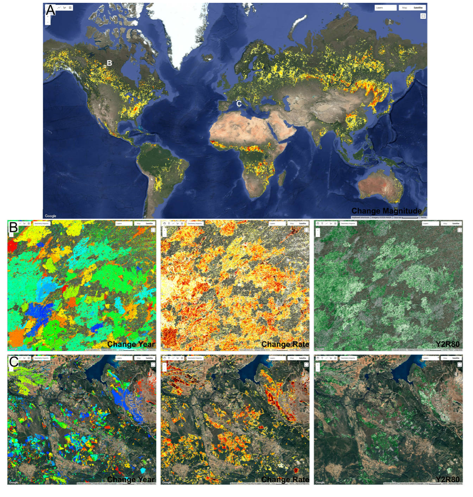

# C2C-GEE

A Google Earth Engine (GEE) implementation of the Composite To Change (C2C) disturbance mapping and change-recovery metrics calculation algorithm.

## GEE documentation

An implementation of the Composite 2 Change (C2C) algorithm. 
This
algorithm segments a time series using a piecewise linear fit with the
minimum number of segments required to fit the data within the given
maximum root mean squared error (RMSE). For each input band, the
algorithm returns the following output bands:

- ***`changeDate`*** (type: `Array[Double]`): The dates at which changes are
  detected. The date format is determined by the `dateFormat` argument.

- ***`value`*** (type: `Array[Double]`): Value of the band at each `changeDate`.

- ***`magnitude`*** (type: `Array[Double]`): The difference between the values
  before and after a change date. The first magnitude is always `NaN`.

- ***`duration`*** (type: `Array[Double]`): The duration of the segment preceding
  the change date. The first duration is always `NaN`.

- ***`rate`*** (type: `Array[Double]`): Rate of change of the data preceding the
  change date. The first rate is always `NaN`.

If `includePostMetrics` is true the following variables are included
per-band.

- ***`postMagnitude`*** (type: `Array[Double]`): The absolute difference between
  the value at the start of the next segment and the value at the change
  date. The last `postMagnitude` is always `NaN`.

- ***`postDuration`*** (type: `Array[Double]`): The duration of the segment
  following the change date. The last `postDuration` is always `NaN`.

- ***`postRate`*** (type: `Array[Double]`): The rate of change of the data
  following the change date. The last `postRate` is always `NaN`.

If `includeRegrowth` is true the following variables are included
per-band.

- ***`indexRegrowth`*** (type: `Array[Double]`): The difference between the value
  at the change date and the value five data points after.

- ***`recoveryIndicator`*** (type: `Array[Double]`): The ratio of `indexRegrowth` to
  magnitude.

- ***`regrowth60`*** (type: `Array[Double]`): Time difference between the change
  date and the data point where the series value is 60% of the
  pre-disturbance value.

- ***`regrowth80`*** (type: `Array[Double]`): Time difference between the change
  date and the data point where the series value is 80% of the
  pre-disturbance value.

- ***`regrowth100`*** (type: `Array[Double]`): Time difference between the change
  date and the data point where the series value is 100% of the
  pre-disturbance value.

See: 
- Hermosilla et al. (2015) <https://doi.org/10.1016/j.rse.2014.11.005> for further details on the original algorithm

- Algorithm implementation can be found on GitHub: <https://github.com/saveriofrancini/C2C-GEE>

Citation: 
```
Hermosilla, T., Wulder, M.A., White, J.C., Coops, N.C., Coelho, D., Ciatto, G., Gorelick, N., Francini, S., 2026. Composite2Change (C2C) on Google Earth Engine: Time-series change detection and metrics characterizing disturbance and recovery. Environmental Modelling & Software (Submitted March 4, 2026).
```

This algorithm is in preview and is subject to change.

### Arguments:

- ***`collection`*** (type: `ImageCollection`): Collection of images on which to run C2C.

- ***`dateFormat`*** (type: `Integer`, default: `0`): The time representation to use during fitting: 
  * 0 = jDays, 
  * 1 = fractional years, 
  * 2 = Unix time in milliseconds. 
  
  The start, end and break times for
each temporal segment will be encoded this way.

- ***`maxErrorList`*** (type: `List`, default: `[]`): List of maximum error (RMSE) values to be used for each band. If not provided, the `maxError` value will be used for all bands.

- ***`spikesToleranceList`*** (type: `List`, default: `[]`): List of spike tolerance values to be used for each band. A value of 1
indicates no spike removal. If not provided, the spikesTolerance value
will be used for all bands.

- ***`spikeRemovalMagnitudeList`*** (type: `List`, default: `[]`): List of spike removal magnitude values to be used for each band. Spikes
with a magnitude above this value are removed. If not provided, the
`spikeRemovalMagnitude` value will be used for all bands.

- ***`maxError`*** (type: `Float`, default: `0.075`): Maximum allowed RMSE of the piecewise linear fit; controls segmentation
sensitivity.

- ***`maxSegments`*** (type: `Integer`, default: `6`): Maximum number of segments permitted in the fitted trajectory.

- ***`infill`*** (type: `Boolean`, default: `true`): Enables gap infilling within the time series to support stable fitting
in the presence of missing values (i.e., values equal to 0).

- ***`spikesTolerance`*** (type: `Float`, default: `0.85`): Controls tolerance of spikes in the time series. Ranges from 0 to 1. A
value of 1 indicates no spike removal, lower values are more aggressive.

- ***`spikeRemovalMagnitude`*** (type: `Float`, default: `0.1`): Spike removal magnitude threshold. Spikes with a magnitude (absolute
difference from the average of neighbors) above this value are removed.

- ***`includePostMetrics`*** (type: `Boolean`, default: `true`): Returns post-change descriptors (`postMagnitude`, `postDuration`, `postRate`).

- ***`includeRegrowth`*** (type: `Boolean`, default: `false`): Returns recovery/regrowth metrics (`indexRegrowth`, `recoveryIndicator`,
`regrowth60`/`80`/`100`).

- ***`interpolateRegrowth`*** (type: `Boolean`, default: `true`): Linearly interpolate the time series using the detected changes before
calculating the regrowth metrics.

- ***`useRelativeRegrowth`*** (type: `Boolean`, default: `false`): Computes regrowth thresholds in relative terms to pre-disturbance
conditions.

- ***`negativeMagnitudeOnly`*** (type: `Boolean`, default: `false`): Retains only breakpoints associated with negative changes (directional
filtering).

## [C2C GEE repository](https://code.earthengine.google.com/?accept_repo=users/sfrancini/C2C)

[This link](https://code.earthengine.google.com/?accept_repo=users/sfrancini/C2C) creates a repository in your scripts "Reader" section where you can find a library including useful functions to manage C2C-GEE row outputs and metrics and to visualise the output of the segmentation process by generating a plot in the console.

To test C2C GEE, different input time series are available as image collections

- Landsat medoid composites for Europe at 30 meters resolution

  ```javascript
  var cmp = ee.ImageCollection("projects/planetunifi/assets/MedoidLandsat_v2");
  ```

- Landsat medoid global composites\*\* at 500 meters resolution

  ```javascript 
  var cmp = ee.ImageCollection("projects/planetunifi/assets/GlobalMedoid");
  ```

  > \*\*Note that this composite was generated using images acquired throughout the entire year and, depending on the intended application, it may not be the best option. We suggest using it mainly for testing the code.

- Landsat BAP composites can be generated globally on the fly

  ```javascript
  var cmp = BAPlibrary.BAP(null, "07-15", 45, 70, 0.7, 0.2, 0.3, 1500);
  ```

See [Francini et al.,(2023)](https://doi.org/10.1016/j.isprsjprs.2023.06.002) and the [BAP GitHub page](https://github.com/saveriofrancini/bap) for more info on BAP usage and parameters configuration.

Setting the first argument as null, the BAP library will calculate BAP
composites globally slowing consistently the visualization process. To
speed up the think you can drow a geometry over your study area and
replacing null with that geometry. In this way the composite will be
calculated using jkusty the images that overlap with the geometry,
speeding up consistently the process

```javascript
var cmp = BAPlibrary.BAP(geometry, "07-15", 45, 70, 0.7, 0.2, 0.3, 1500);
```

For more information on how these composites are calculated and on the
BAP parameters (the third suggested composite), see Francini et al.,
(2023)

Below are shown examples of the different forest disturbance and recovery metrics obtained using the 'test' sciprt in the C2C-GEE
repository. 

<figure>
  
  <figcaption><strong>Figure 1:</strong> Disturbance severity</figcaption>
</figure>

<figure>
  
  <figcaption><strong>Figure 2:</strong> Disturbance recovery</figcaption>
</figure>

<figure>
  
  <figcaption><strong>Figure 3:</strong> Disturbance year</figcaption>
</figure>

If you do not want to clone the repository, you can access
the code using [this link](https://code.earthengine.google.com/f4ac48aea4ae9365f2e4a9a2133da3c6). The link will redirect you to GEE, where **after a few seconds** you will be able to view the outputs generated dynamically.
However, please note that, unlike the test code in the C2C-GEE repository, this link is static and the code will remain the same even if further modifications are made to the repository.

```javascript
// for info saverio.francini@unibo.it
var yearsPalette = ["#440154FF", "#460A5DFF", "#471366FF",
"#481C6EFF", "#482475FF", "#472C7AFF",
"#46337FFF", "#443A84FF", "#414287FF", "#3E4989FF",
"#3C508BFF", "#39578CFF",
"#355E8DFF", "#32648EFF", "#306A8EFF", "#2D708EFF",
"#2B768EFF", "#287C8EFF",
"#26828EFF", "#24878EFF", "#228D8DFF", "#20938CFF",
"#1F998AFF", "#1F9F88FF",
"#20A486FF", "#25AA83FF", "#2AB07FFF", "#32B67AFF",
"#3BBB75FF", "#47C06FFF",
"#53C568FF", "#60CA60FF", "#6ECE58FF", "#7DD250FF",
"#8CD645FF", "#9CD93BFF",
"#ADDC30FF", "#BDDF26FF", "#CEE11DFF", "#DEE318FF",
"#EEE51CFF", "#FDE725FF"];

Map.setOptions('SATELLITE');

// required functions
var BAPlibrary = require("users/sfrancini/bap:library");
var C2Clibrary = require("users/sfrancini/C2C:library");

// input data
var wc = ee.ImageCollection("ESA/WorldCover/v200");

var cmp = ee.ImageCollection("projects/planetunifi/assets/MedoidLandsat_v2");

// var cmp = BAPlibrary.BAP(geometry, "07-15", 45, 70, 0.7, 0.2, 0.3, 1500);

// var cmp = ee.ImageCollection("projects/planetunifi/assets/GlobalMedoid"); // "07-02"

// calculate index
cmp = cmp.map(function(i){
  return i.addBands(i.normalizedDifference(['nir', 'swir2']).multiply(1000))}
).select(["nd"], ["NBR"]);

// run c2c temporal segmentation and change metrics calculation
var outArray = ee.Algorithms.TemporalSegmentation.C2c({
  collection: cmp,
  dateFormat: 1,
  maxError: 75,
  maxSegments: 10,
  infill: true,
  spikesTolerance: 0.85,
  spikeRemovalMagnitude: 100,
  includePostMetrics: true,
  includeRegrowth: true,
  interpolateRegrowth: true,
  useRelativeRegrowth: false,
  negativeMagnitudeOnly: false,
});

// use the inspector to see raw c2c outputs (multidimensional array images)
Map.addLayer(outArray, {}, "raw output", false);

// manage output
var disturbanceCollection = C2Clibrary.arrayImageToCollection(outArray,1984,2025, "08-01");

// use the inspector to see raw c2c outputs (multidimensional array images)
Map.addLayer(disturbanceCollection, {}, "disturbanceCollection",
false);

// calculate the greatest disturbance magnitude composite
var disturbanceImage = C2Clibrary.collectionToImage(disturbanceCollection, "NBR_magnitude",
true);

// mask out no forest areas and low magnitude disturbances
disturbanceImage = disturbanceImage.updateMask(wc.first().eq(10)).updateMask(disturbanceImage.select("NBR_magnitude").lte(-150));

// visualization
Map.addLayer(
  disturbanceImage.updateMask(disturbanceImage.select("NBR_changeDate").floor().neq(2025)),
  { bands: "NBR_magnitude", min: -700, max: -150, palette: ["black", "red", "yellow", "white"]}, 
  "Disturbance severity", 
  true
);

Map.addLayer(
  disturbanceImage.updateMask(disturbanceImage.select("NBR_changeDate").floor().neq(2025)),
  {bands: "NBR_regrowth80", min: 1, max: 8, palette: ["green", "orange", "red"]}, 
  "years to recovery (y2r)", 
  false
);

Map.addLayer(
  disturbanceImage.updateMask(disturbanceImage.select("NBR_changeDate").floor().neq(2025)),
  {bands: "NBR_changeDate", min:1984, max:2025, palette: yearsPalette},
  "Distudbance year", 
  false
);

// click on a pixel to see the time series
var joinedCollections = C2Clibrary.joinCollections(cmp, disturbanceCollection, 'system:time_start');

C2Clibrary.plotTS(joinedCollections);
```

# Acknowledgements
## FORWARDS. H2020 project funded by the European Commission, number 101084481 call HORIZON-CL6-2022-CLIMATE-01-05
## NextGenCarbon. H2020 project funded by the European Commission, number 101184989 call HORIZON-CL5-2024-D1-01-07

## Reference
Hermosilla, T., Wulder, M. A., White, J. C., Coops, N. C., Coelho, D., Ciatto, G., Gorelick, N., & Francini, S. (under review).
*Composite2Change (C2C) on Google Earth Engine: Time-series change
detection and metrics characterizing disturbance and recovery*.
Manuscript submitted for publication to *Environmental Modelling &
Software*.
